<p align="center">
  
</p>

<h1 align="center">Decision Origami: GenLayer Spinner</h1>

<p align="center"><b>A production-ready GenLayer loading spinner built from the GenLayer mark itself.</b></p>

<p align="center">
  <a href="https://ometere123.github.io/genlayer-consensus-spinner/"></a>
  <a href="https://ometere123.github.io/genlayer-consensus-spinner/loading.html"></a>
  
  
  
</p>

**Decision Origami** is a GenLayer-native loading animation created for the **Design the GenLayer Spinner** Builder mission. Instead of placing a generic ring, orbit, or progress indicator around the brand, the GenLayer mark itself becomes the motion system.

The two outer wings fold as true mirrors, the center core resolves only after the wings are nearly seated, and an exact static copy of the GenLayer mark holds at the decision point before the movement reverses into the next loading cycle.

The result is designed to be visually distinctive enough to carry GenLayer identity while still behaving like a practical Portal component that can be used repeatedly across pages, cards, buttons, modals, and loading states.

## Live demos

| Experience | Purpose |
| --- | --- |
| [Design playground](https://ometere123.github.io/genlayer-consensus-spinner/) | Inspect the spinner on light and dark surfaces and compare it at 16, 20, 24, 32, 48 and 64 px |
| [Portal loading simulation](https://ometere123.github.io/genlayer-consensus-spinner/loading.html) | See the spinner inside a responsive Portal-style loading state on desktop and mobile |
| [Production SVG](src/genlayer-spinner.svg) | Standalone zero-dependency asset for direct integration |
| [React component](src/GenLayerSpinner.tsx) | Optional typed wrapper for React applications |

GitHub Pages is published from `main/docs` with HTTPS enabled.

## The concept

A loading spinner is usually treated as decoration. Decision Origami treats it as a tiny piece of product storytelling.

The animation represents structure resolving into a final state:

1. **Mirror**: the left and right wings begin together and move with equal but opposite transforms.
2. **Seat**: both wings approach their exact positions at the same rate.
3. **Resolve**: the center core unfolds only after the outer geometry is nearly complete.
4. **Finality**: an exact static copy of the full GenLayer mark appears and holds.
5. **Confirm**: a restrained outline pulse marks the resolution moment.
6. **Repeat**: the same geometry reverses into the next cycle.

This keeps the motion readable. Nothing flies back into place randomly and neither side gets ahead of the other.

## Why it fits GenLayer

The spinner uses the GenLayer mark as both the visual identity and the animation structure.

The final state is not an approximation produced by animation interpolation. During the finality hold, the implementation displays the exact three canonical polygons used for the mark. This guarantees that the resolved frame returns to the intended GenLayer shape before the loop begins to reverse.

The ordered progression from separate moving geometry to one exact result also gives the spinner a natural relationship with GenLayer's broader identity around independent reasoning, agreement, and resolution without turning a small loading component into an overcomplicated protocol diagram.

## Mission requirement mapping

| Mission requirement | Implementation |
| --- | --- |
| Original animated spinner | Decision Origami uses an original fold, resolve, finality, and reverse choreography |
| Web-ready format | Standalone SVG plus reusable CSS and an optional React/TypeScript wrapper |
| Smooth infinite loop | Default duration is `2.12s` and every animated layer loops infinitely |
| Light backgrounds | Uses `currentColor` and is demonstrated on white surfaces |
| Dark backgrounds | Uses `currentColor` and is demonstrated on dark surfaces |
| Readable at small sizes | Tested in the playground at 16, 20, 24, 32, 48 and 64 px |
| GenLayer identity | The motion is constructed directly from the GenLayer mark geometry |
| Mobile and desktop | One scalable SVG asset is used across both; the Portal simulation is responsive |
| Reduced motion | `prefers-reduced-motion` removes the animation and leaves the exact static mark |
| Integration ready | No JavaScript animation runtime and no external motion library are required |

## Motion choreography

### 0% to 38%: mirrored wing fold

The two outer wings begin on the same frame. Their translations, rotations, scale changes, easing curve, and keyframe timestamps are mirrored exactly.

Left wing start:

```text
translate(-118px, 16px) rotate(-44deg)
```

Right wing start:

```text
translate(118px, 16px) rotate(44deg)
```

Both arrive at their seated position at the same point in the timeline.

### 24% to 64%: core resolve

The center core does not compete with the wings. It remains out of the resolved composition until the outer structure is nearly seated, then unfolds upward and settles into its exact position.

### 64% to 80%: exact logo lock

A separate static copy of the full GenLayer mark becomes visible during the lock window.

This is deliberate. It prevents tiny differences caused by transform interpolation from making the final resolved frame look like a near-match instead of the actual logo.

### 68% to 90%: confirmation pulse

A single outline pulse expands from the resolved mark. It uses the same `currentColor` as the spinner and introduces no additional brand color or visual noise.

### 78% to 100%: mirrored reverse

The spinner leaves the finality state using the same mirrored geometry. Both outer wings remain synchronized during the reset so the loop feels deliberate rather than scattered.

For the full motion specification, see [DESIGN.md](DESIGN.md).

## Exact logo geometry

The production SVG uses a `400 x 400` viewBox and three polygon groups for the resolved GenLayer mark:

```text
left:  183,33 20,372 179,310 122,279 183,152
right: 218,33 218,151 280,281 222,310 382,373
core:  200,195 166,265 200,283 235,266
```

The same geometry is shared by the standalone SVG and React implementation.

## Implementation architecture

```text
GenLayer mark geometry
        |
        v
mirrored wing transforms
        |
        v
core resolve
        |
        v
exact static logo lock
        |
        v
confirmation pulse
        |
        v
mirrored reverse
```

The package exposes the same motion in three practical forms:

1. `src/genlayer-spinner.svg` for the smallest possible integration surface.
2. `src/genlayer-spinner.css` for projects that want the animation rules separated from inline SVG markup.
3. `src/GenLayerSpinner.tsx` for React projects that want typed size, duration, color, label, and standard SVG props.

## Standalone SVG

The primary deliverable is [src/genlayer-spinner.svg](src/genlayer-spinner.svg).

It contains its own geometry and keyframes, so no JavaScript or third-party animation package is needed.

For best theming behavior, use the SVG inline so it can inherit `currentColor`:

```html
<div style="width:24px;height:24px;color:#000">
  <!-- inline src/genlayer-spinner.svg here -->
</div>
```

On a dark surface:

```html
<div style="width:24px;height:24px;color:#fff;background:#000">
  <!-- inline src/genlayer-spinner.svg here -->
</div>
```

The default duration can also be overridden through the CSS variable used by the production asset:

```css
.spinner-host {
  --gl-spinner-duration: 2.5s;
}
```

## React integration

The repository includes an optional React wrapper:

```tsx
import { GenLayerSpinner } from "./src/GenLayerSpinner";

export function LoadingState() {
  return <GenLayerSpinner size={24} />;
}
```

Custom size, duration, color, and accessible label:

```tsx
<GenLayerSpinner
  size={32}
  duration="2.5s"
  color="currentColor"
  label="Loading contributions"
/>
```

### Component props

| Prop | Type | Default | Purpose |
| --- | --- | --- | --- |
| `size` | `number | string` | `24` | Controls rendered width and height |
| `duration` | `string` | `2.12s` | Controls the full animation cycle |
| `color` | `string` | `currentColor` | Lets the spinner inherit or override surrounding text color |
| `label` | `string` | `Loading` | Accessible status label |
| standard SVG props | `SVGProps<SVGSVGElement>` | n/a | Supports class names, event handlers, data attributes, and other SVG props |

React is an optional peer dependency. The standalone SVG does not require React.

## Light and dark theming

The spinner does not hard-code black or white into the production component. It uses `currentColor` for fills and strokes.

That means the host interface decides the final color:

```css
.light-surface {
  color: #000;
}

.dark-surface {
  color: #fff;
}
```

This keeps the component compatible with the Portal's own design tokens rather than forcing a separate light asset and dark asset.

## Mobile and desktop behavior

There is no separate mobile spinner or desktop spinner.

SVG geometry is resolution independent, so the same asset can be rendered at compact control sizes on mobile and larger page-level sizes on desktop without losing sharpness.

Recommended usage ranges:

| Context | Suggested size |
| --- | --- |
| Compact button or inline state | 16 to 24 px |
| Card or modal loading state | 24 to 40 px |
| Page-level loading state | 48 to 64 px |

The [Portal loading simulation](https://ometere123.github.io/genlayer-consensus-spinner/loading.html) includes responsive layout behavior so the same spinner can be evaluated inside both desktop and mobile compositions.

## Why there is no visible "Loading..." inside the component

The spinner intentionally does not render permanent visible loading text.

A reusable Portal loader may appear inside a button, next to existing copy, in a card, or in a full-page state. Baking `Loading...` into the component would make it less flexible and could create duplicated text in real product contexts.

Accessibility is still covered. The React wrapper defaults to:

```tsx
role="status"
aria-label="Loading"
```

Product surfaces can supply more specific status text when context requires it.

## Reduced motion

The production asset respects the user's operating-system motion preference:

```css
@media (prefers-reduced-motion: reduce) {
  /* animated pieces stop and the exact GenLayer mark remains */
}
```

In reduced-motion mode, the left wing, right wing, and core remain in their exact resolved positions while creases, the lock duplicate, and confirmation pulse are hidden.

## Small-size testing

The design playground renders the same spinner at:

```text
16px
20px
24px
32px
48px
64px
```

The `24px` version is treated as the primary compact Portal target, while the larger sizes demonstrate that the same component can scale to page-level loading states.

[Open the live size playground](https://ometere123.github.io/genlayer-consensus-spinner/)

## Portal context simulation

The repository includes `docs/loading.html`, a responsive mock loading state informed by the real GenLayer Portal interface.

Its purpose is not to redesign or reproduce the Portal. It exists to answer one practical review question: **what does this spinner feel like when it is actually being used inside the product?**

The simulation includes:

- desktop and mobile layouts;
- a centered page-level spinner state;
- light and dark switching;
- underlying content skeletons to communicate active loading;
- no permanent visible loading label competing with the spinner;
- direct navigation back to the design playground.

[Open the live Portal loading simulation](https://ometere123.github.io/genlayer-consensus-spinner/loading.html)

## Validation

The repository includes a zero-dependency structural validation script.

Run:

```bash
npm test
```

or:

```bash
npm run check
```

The current validation suite contains **15 checks** covering:

1. canonical `400 x 400` viewBox;
2. exact left logo polygon;
3. exact right logo polygon;
4. exact core logo polygon;
5. left wing start transform;
6. mirrored right wing start transform;
7. matching left and right timing points;
8. exact-logo finality hold;
9. `currentColor` theming;
10. duration CSS variable;
11. infinite looping;
12. reduced-motion support;
13. React geometry parity;
14. light and dark demo surfaces;
15. all six target demo sizes.

The test is intentionally dependency free and runs directly with Node.

## Performance characteristics

The standalone spinner is intentionally small in scope:

- no JavaScript animation loop;
- no canvas;
- no WebGL;
- no Lottie runtime;
- no image sequence;
- no network request required for the animation itself;
- transform and opacity based movement for the primary pieces;
- one SVG asset can serve mobile and desktop;
- optional React wrapper only when a consuming application needs it.

## Repository layout

```text
.
├── README.md
├── DESIGN.md
├── SUBMISSION.md
├── LICENSE
├── package.json
├── index.html
├── src/
│   ├── genlayer-spinner.svg
│   ├── genlayer-spinner.css
│   └── GenLayerSpinner.tsx
├── docs/
│   ├── index.html
│   ├── loading.html
│   └── genlayer-spinner.svg
└── tests/
    └── validate.mjs
```

### Important files

| File | Purpose |
| --- | --- |
| [`src/genlayer-spinner.svg`](src/genlayer-spinner.svg) | Canonical production asset |
| [`src/genlayer-spinner.css`](src/genlayer-spinner.css) | Reusable animation rules for inline component integration |
| [`src/GenLayerSpinner.tsx`](src/GenLayerSpinner.tsx) | Optional React/TypeScript component |
| [`docs/index.html`](docs/index.html) | Live design and size playground |
| [`docs/loading.html`](docs/loading.html) | Responsive Portal loading-state simulation |
| [`DESIGN.md`](DESIGN.md) | Motion rationale, choreography, and exact geometry |
| [`tests/validate.mjs`](tests/validate.mjs) | Structural validation suite |
| [`SUBMISSION.md`](SUBMISSION.md) | Builder mission submission copy and evidence |

## Builder mission submission

**Contribution type:** Builder  
**Mission:** Design the GenLayer Spinner  
**Design:** Decision Origami  
**Format:** Animated SVG with CSS, plus optional React wrapper

### Evidence

- Repository: `https://github.com/ometere123/genlayer-consensus-spinner`
- Live design demo: `https://ometere123.github.io/genlayer-consensus-spinner/`
- Live Portal simulation: `https://ometere123.github.io/genlayer-consensus-spinner/loading.html`

The repository is the canonical evidence artifact. The two GitHub Pages links provide immediate browser-based review of both the design itself and a realistic product loading context.

## Design principles

Decision Origami follows five rules:

1. **GenLayer first**: the mark itself is the animation, not decoration added around it.
2. **Symmetry is exact**: the two outer wings use mirrored timing and transform values.
3. **Resolution must be canonical**: the full mark is shown from exact static geometry during the finality hold.
4. **Small-size clarity matters**: the motion is evaluated at compact Portal sizes, not only as a large presentation animation.
5. **Production flexibility matters**: color, size, duration, accessibility, mobile use, desktop use, and framework integration remain configurable.

## License

MIT. See [LICENSE](LICENSE).

Copyright (c) 2026 Dele-Alufe Ometere Joel.
